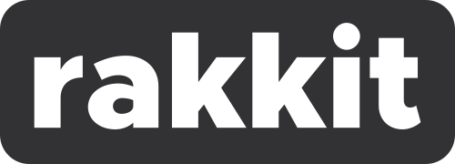

<p align="center">
  
  <br>
  A simple backend framework written in <b>TypeScript</b> to build amazing server-side application that provide <b>GraphQL / REST API</b> and <b>Websocket</b> tools. 
</p>
  
  
### Getting started  
```
npm i -rakkit
```
```
yarn add rakkit
```

### The project history  
Initially this tool was to be used to create a homemade Headless CMS. But as the project progressed, our needs grew and our backend application looked more and more like a Framework, so we chose to make it an independent tool to benefit the community and progress on a better basis.

### Philosophy  
We wanted to create a tool that would allow us to create backend applications much more simply with a small learning curve, so that anyone, with some TypeScript basics, could use it. We also didn't want to make a clone of NestJS.

### Project core  
At the heart of the project there is a [type-graphql](https://github.com/19majkel94/type-graphql) fork, which allowed us to move forward to develop the GraphQL part relatively quickly. Changes have also been made to support generic classes and to standardize the REST and GraphQL part (for the use of middlewares). For this reason, you can, in part, refer to the (very well provided) [documentation](https://19majkel94.github.io/type-graphql/) of it.

### Features (Full typed, class based)  
- GraphQL API Creation
- Rest API Creation ([koa](https://koajs.com/) base)
- Websocket support (socket.io)
- Typeorm interface to optimize and execute SQL queries with GraphQL

### Contributing  
You can simply clone the project and submit a pull request, we will analyze it and decide whether or not it is valid.

### Primary necessity before releasing  
- Unit-test
- Documentation
- Travis CI Integration
- Codecov integration
- Provide examples
